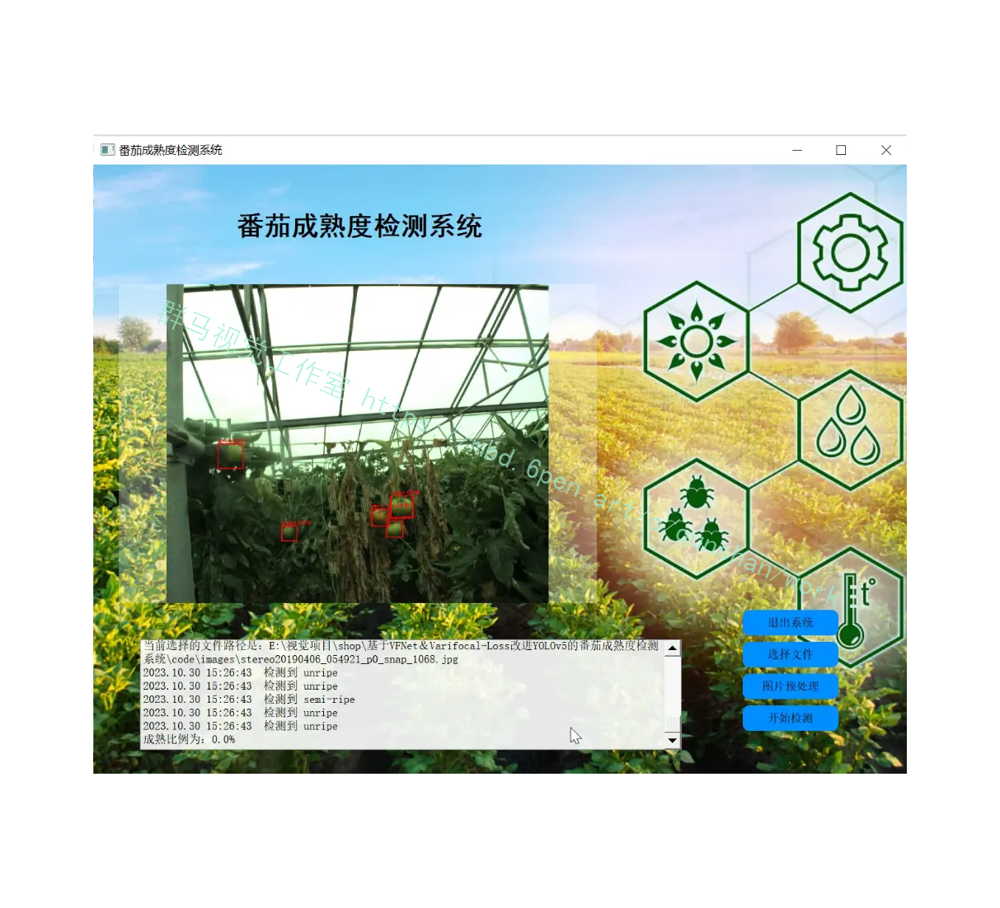
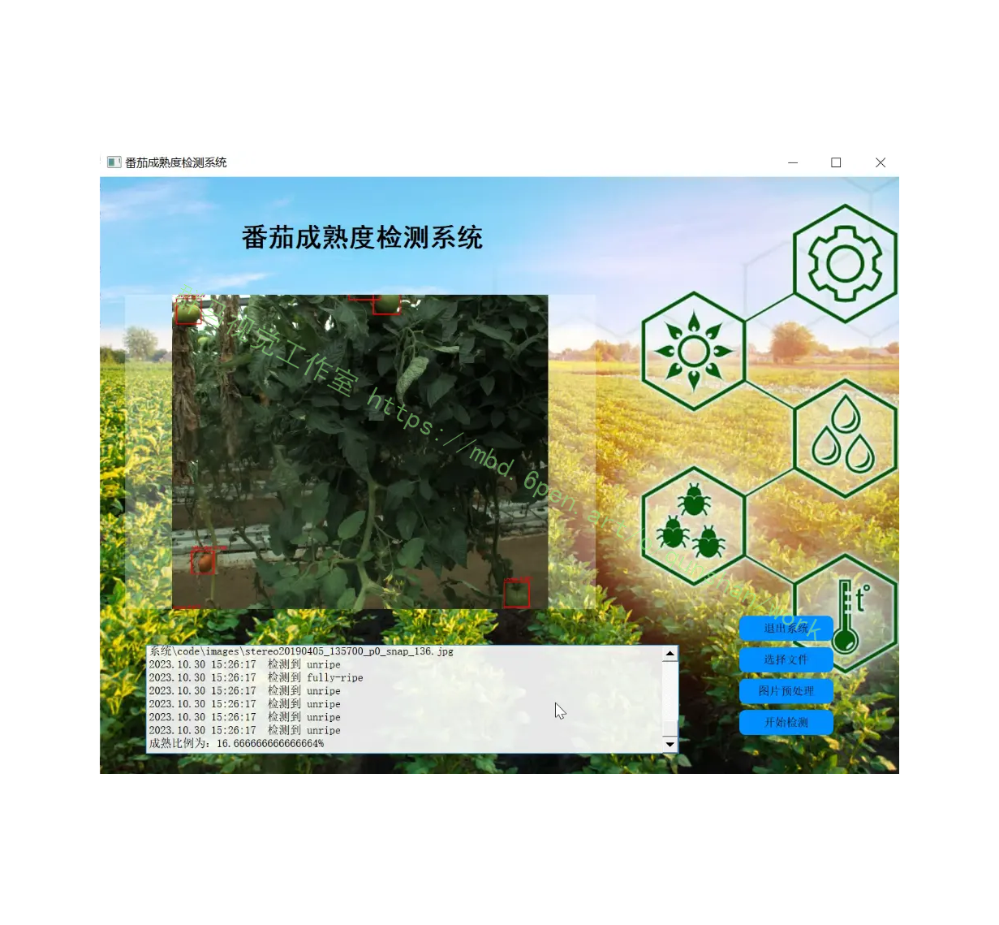
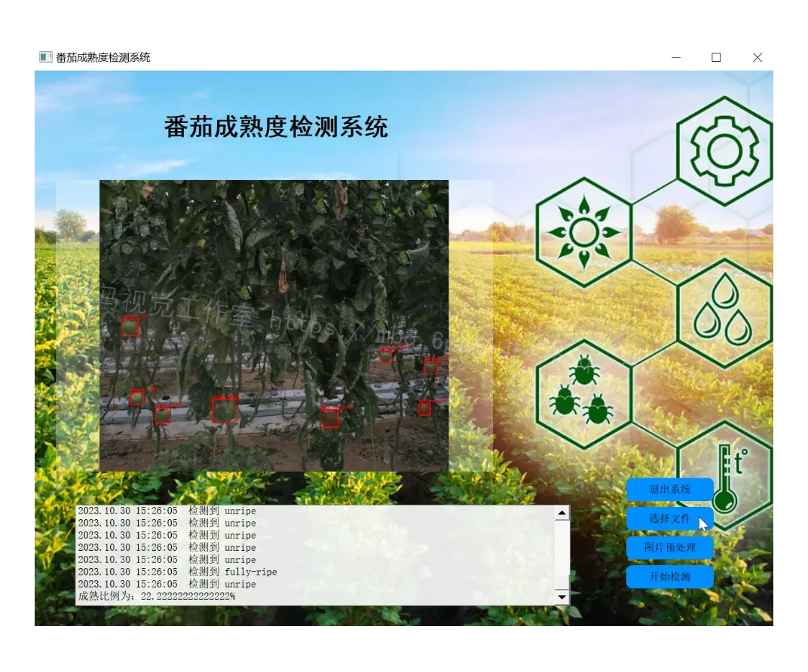
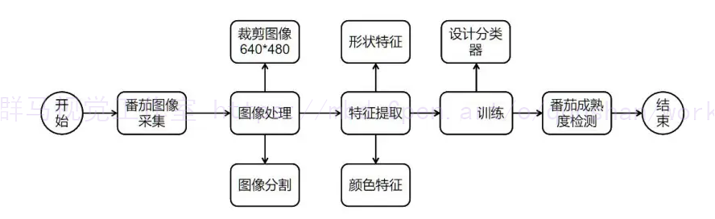
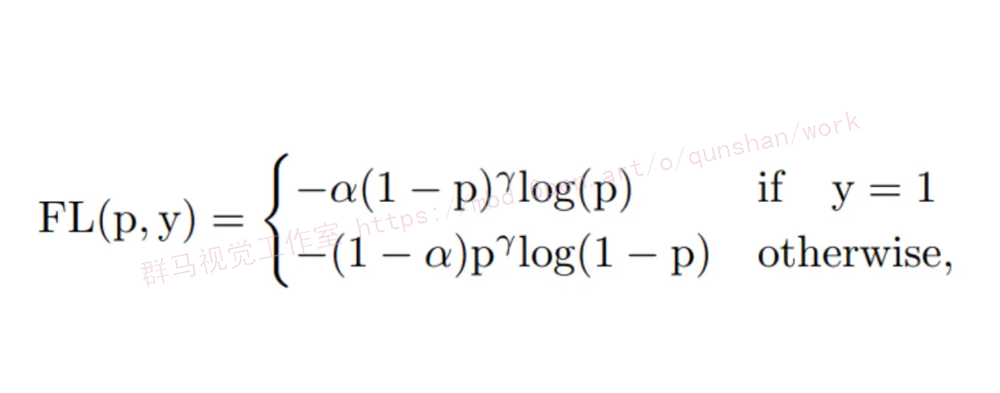
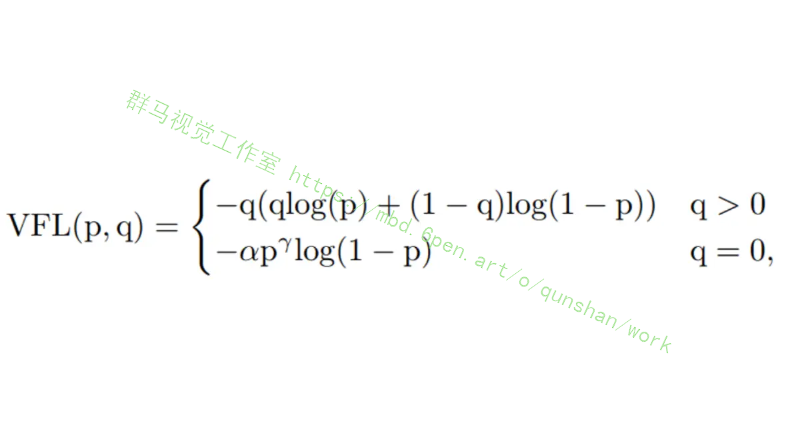
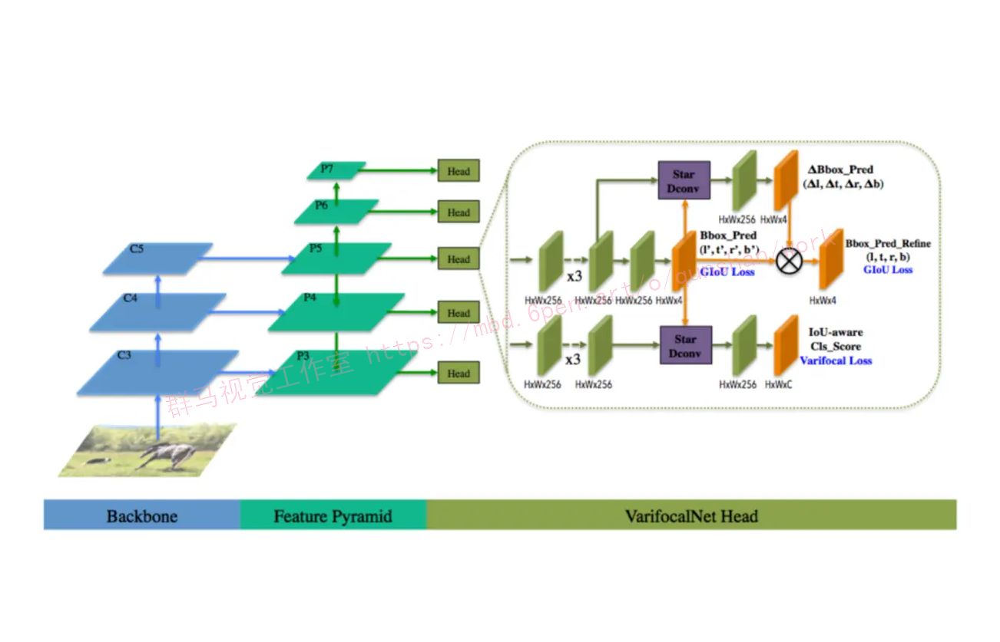
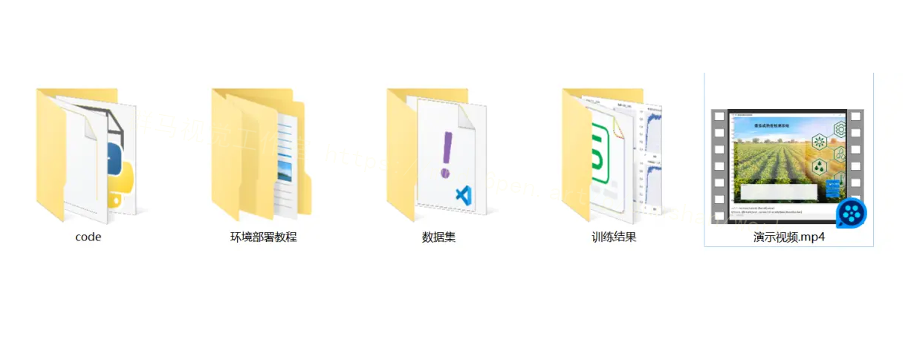



# 1.研究背景与意义


随着农业科技的发展和人们对食品安全的关注，农作物的质量和产量监测变得越来越重要。番茄作为全球最重要的蔬菜之一，其成熟度的检测对于农民和食品加工企业来说至关重要。传统的番茄成熟度检测方法通常依赖于人工采样和视觉判断，这种方法费时费力且容易出现误判。因此，开发一种高效准确的番茄成熟度检测系统具有重要的现实意义。

近年来，深度学习技术在计算机视觉领域取得了巨大的突破，特别是目标检测领域。YOLOv5是一种基于深度学习的目标检测算法，具有高效、准确和实时的特点。然而，YOLOv5在番茄成熟度检测方面仍然存在一些挑战。首先，番茄的成熟度变化非常微妙，需要高分辨率的图像才能准确检测。其次，番茄的形状和颜色在不同的成熟度阶段有所不同，传统的目标检测算法很难捕捉到这些细微的特征。因此，我们需要对YOLOv5进行改进，以提高番茄成熟度检测的准确性和稳定性。

VFNet和Varifocal-Loss是近期提出的两种目标检测的改进方法。VFNet通过引入可变焦距机制，能够自适应地调整感受野的大小，从而提高目标检测的准确性。Varifocal-Loss则通过引入可变权重机制，能够更好地处理目标检测中的不平衡问题，提高小目标的检测效果。基于这两种方法，我们可以对YOLOv5进行改进，以提高番茄成熟度检测的准确性和稳定性。

开发基于VFNet和Varifocal-Loss改进的YOLOv5番茄成熟度检测系统具有以下几个重要的意义：

1. 提高番茄成熟度检测的准确性：传统的目标检测算法往往无法准确捕捉到番茄成熟度变化的微妙特征，而基于VFNet和Varifocal-Loss改进的YOLOv5能够更好地处理这些细微的特征，从而提高番茄成熟度检测的准确性。

2. 提高番茄成熟度检测的稳定性：传统的目标检测算法在处理小目标和不平衡问题时往往效果不佳，而基于Varifocal-Loss的改进方法能够更好地处理这些问题，提高番茄成熟度检测的稳定性。

3. 提高番茄产量和质量的监测效率：传统的番茄成熟度检测方法通常需要人工采样和视觉判断，费时费力且容易出现误判。而基于VFNet和Varifocal-Loss改进的YOLOv5能够实现自动化的番茄成熟度检测，提高监测效率，减少人力成本，并提高番茄产量和质量的监测效果。

4. 推动农业科技的发展：基于VFNet和Varifocal-Loss改进的YOLOv5番茄成熟度检测系统不仅可以应用于番茄成熟度检测，还可以推广到其他农作物的质量和产量监测中，推动农业科技的发展。

综上所述，基于VFNet和Varifocal-Loss改进的YOLOv5番茄成熟度检测系统具有重要的研究背景和意义。通过提高番茄成熟度检测的准确性和稳定性，该系统可以提高番茄产量和质量的监测效率，推动农业科技的发展，并为农民和食品加工企业提供更可靠的决策依据。

# 2.图片演示






# 3.视频演示
[基于VFNet＆Varifocal-Loss改进YOLOv5的番茄成熟度检测系统_哔哩哔哩_bilibili](https://www.bilibili.com/video/BV1EQ4y1H73J/?spm_id_from=333.999.0.0&vd_source=ff015de2d29cbe2a9cdbfa7064407a08)


# 4.番茄成熟度检测流程图
本研究是基于颜色特征对番茄成熟度进行检测。
第一部分是本文的绪论部分。主要介绍了本研究的研究背景和研究意义，并对所用到的技术（图像处理、特征提取、SVM)介绍了各个技术在成熟度检测方向上的国内外现状。
第二部分首先介绍了本研究的实验环境，工作环境，数据采集的方法。
第三部分是番茄图像分割算法及所用的Grab Cut算法的改进。采用通过少量人机交互操作即可取得较好分割效果的Grab Cut分割算法对在温室中采集到的番茄图像进行图像分割处理，Grab Cut算法是Graphcuts算法的改进，它总共有两个高斯混合模型(GMM）分别是背景和前景，为接下来要进行番茄的特征提取打下了基础。
第四部分是番茄特征参数的提取。介绍了常见的颜色空间，通过分析和比较RGB、HSV等多个颜色空间模型，通过试验确定采用不受光照影响的HSV颜色空间模型，将分割后的番茄图像从原始的RGB颜色空间转化到所需要的HSV颜色空间。通过对两种外部特征提取方向分析得出结论，成熟度等级不同番茄根据其外部的形状特征参数进行特征提取结果并不精确，不能作为区分其成熟的依据。而将分割后的番茄图像从RGB颜色空间转化到HSV颜色空间下的H分量颜色特征值相差非常大，所以以此作为区分番茄成熟度的依据。通过K-means均值聚类算法对H分量均值进行聚类分析，将原始训练集分为三个子集。



# 5.核心代码讲解

#### 5.1 ui.py

下面是封装为类的代码：

```python

class YOLOv5Detector:
    def __init__(self):
        FILE = Path(__file__).resolve()
        ROOT = FILE.parents[0]  # YOLOv5 root directory
        if str(ROOT) not in sys.path:
            sys.path.append(str(ROOT))  # add ROOT to PATH
        ROOT = Path(os.path.relpath(ROOT, Path.cwd()))  # relative

        from models.common import DetectMultiBackend
        from utils.augmentations import letterbox
        from utils.datasets import IMG_FORMATS, VID_FORMATS, LoadImages, LoadStreams
        from utils.general import (LOGGER, check_file, check_img_size, check_imshow, check_requirements, colorstr,
                                   increment_path, non_max_suppression, print_args, scale_coords, strip_optimizer, xyxy2xywh)
        from utils.plots import Annotator, colors, save_one_box
        from utils.torch_utils import select_device, time_sync

        self.model = None
        self.stride = None
        self.names = None
        self.pt = None
        self.jit = None
        self.onnx = None
        self.engine = None

    def load_model(
            self,
            weights='./best.pt',  # model.pt path(s)
            data=ROOT / 'data/coco128.yaml',  # dataset.yaml path
            device='',  # cuda device, i.e. 0 or 0,1,2,3 or cpu
            half=False,  # use FP16 half-precision inference
            dnn=False,  # use OpenCV DNN for ONNX inference

    ):
        # Load model
        device = select_device(device)
        self.model = DetectMultiBackend(weights, device=device, dnn=dnn, data=data)
        self.stride, self.names, self.pt, self.jit, self.onnx, self.engine = self.model.stride, self.model.names, self.model.pt, self.model.jit, self.model.onnx, self.model.engine

        # Half
        half &= (self.pt or self.jit or self.onnx or self.engine) and device.type != 'cpu'  # FP16 supported on limited backends with CUDA
        if self.pt or self.jit:
            self.model.model.half() if half else self.model.model.float()

    def run(self, img, stride, pt,
            imgsz=(640, 640),  # inference size (height, width)
            conf_thres=0.15,  # confidence threshold
            iou_thres=0.15,  # NMS IOU threshold
            max_det=1000,  # maximum detections per image
            device='',  # cuda device, i.e. 0 or 0,1,2,3 or cpu
            classes=None,  # filter by class: --class 0, or --class 0 2 3
            agnostic_nms=False,  # class-agnostic NMS
            augment=False,  # augmented inference
            half=False,  # use FP16 half-precision inference
    ):
        cal_detect = []

        device = select_device(device)
        names = self.model.module.names if hasattr(self.model, 'module') else self.model.names  # get class names

        # Set Dataloader
        im = letterbox(img, imgsz, stride, pt)[0]

        # Convert
        im = im.transpose((2, 0, 1))[::-1]  # HWC to CHW, BGR to RGB
        im = np.ascontiguousarray(im)

        im = torch.from_numpy(im).to(device)
        im = im.half() if half else im.float()  # uint8 to fp16/32
        im /= 255  # 0 - 255 to 0.0 - 1.0
        if len(im.shape) == 3:
            im = im[None]  # expand for batch dim

        pred = self.model(im, augment=augment)

        pred = non_max_suppression(pred, conf_thres, iou_thres, classes, agnostic_nms, max_det=max_det)
        # Process detections
        for i, det in enumerate(pred):  # detections per image
            if len(det):
                # Rescale boxes from img_size to im0 size
                det[:, :4] = scale_coords(im.shape[2:], det[:, :4], img.shape).round()

                # Write results

                for *xyxy, conf, cls in reversed(det):
                    c = int(cls)  # integer class
                    label = f'{names[c]}'

                    cal_detect.append([label, xyxy,str(float(conf))[:5]])
        return cal_detect


class Ui_MainWindow(object):
    def setupUi(self, MainWindow):
        MainWindow.setObjectName("MainWindow")
        MainWindow.resize(1280, 960)
        MainWindow.setStyleSheet("background-image: url(\"./template/carui.png\")")
        self.centralwidget = QtWidgets.QWidget(MainWindow)
        self.centralwidget.setObjectName("centralwidget")
        self.label = QtWidgets.QLabel(self.centralwidget)
        self.label.setGeometry(QtCore.QRect(168, 60, 501, 71))
        self.label.setAutoFillBackground(False)
        self.label.setStyleSheet("")
        self.label.setFrameShadow(QtWidgets.QFrame.Plain)
        self.label.setAlignment(QtCore.Qt.AlignCenter)
        self.label.setObjectName("label")
        self.label.setStyleSheet("font-size:42px;font-weight:bold;font-family:SimHei;background:rgba(255,255,255,0);")
        ......
```
该程序文件是一个基于YOLOv5的番茄成熟度检测系统的图形界面程序。程序使用PyQt5库创建了一个窗口，并在窗口中显示了一个标签、一个图片框和几个按钮。用户可以通过点击按钮选择图片文件、对图片进行预处理和开始检测。检测结果将显示在文本框中，并在图片上绘制出检测框和标签。用户还可以点击退出系统按钮退出程序。

程序中还定义了一些辅助函数，如加载模型、运行检测、绘制检测结果等。这些函数通过调用YOLOv5的相关函数实现了番茄成熟度的检测。

#### 5.2 varifocal_loss.py

```python

class VarifocalLoss(nn.Module):

    def __init__(self,
                 use_sigmoid=True,
                 alpha=0.75,
                 gamma=2.0,
                 iou_weighted=True,
                 reduction='mean',
                 loss_weight=1.0):
        """`Varifocal Loss <https://arxiv.org/abs/2008.13367>`_

        Args:
            use_sigmoid (bool, optional): Whether the prediction is
                used for sigmoid or softmax. Defaults to True.
            alpha (float, optional): A balance factor for the negative part of
                Varifocal Loss, which is different from the alpha of Focal
                Loss. Defaults to 0.75.
            gamma (float, optional): The gamma for calculating the modulating
                factor. Defaults to 2.0.
            iou_weighted (bool, optional): Whether to weight the loss of the
                positive examples with the iou target. Defaults to True.
            reduction (str, optional): The method used to reduce the loss into
                a scalar. Defaults to 'mean'. Options are "none", "mean" and
                "sum".
            loss_weight (float, optional): Weight of loss. Defaults to 1.0.
        """
        super(VarifocalLoss, self).__init__()
        assert use_sigmoid is True, \
            'Only sigmoid varifocal loss supported now.'
        assert alpha >= 0.0
        self.use_sigmoid = use_sigmoid
        self.alpha = alpha
        self.gamma = gamma
        self.iou_weighted = iou_weighted
        self.reduction = reduction
        self.loss_weight = loss_weight

    def forward(self,
                pred,
                target,
                weight=None,
                avg_factor=None,
                reduction_override=None):
        """Forward function.

        Args:
            pred (torch.Tensor): The prediction.
            target (torch.Tensor): The learning target of the prediction.
            weight (torch.Tensor, optional): The weight of loss for each
                prediction. Defaults to None.
            avg_factor (int, optional): Average factor that is used to average
                the loss. Defaults to None.
            reduction_override (str, optional): The reduction method used to
                override the original reduction method of the loss.
                Options are "none", "mean" and "sum".

        Returns:
            torch.Tensor: The calculated loss
        """
        assert reduction_override in (None, 'none', 'mean', 'sum')
        reduction = (
            reduction_override if reduction_override else self.reduction)
        if self.use_sigmoid:
            loss_cls = self.loss_weight * varifocal_loss(
                pred,
                target,
                weight,
                alpha=self.alpha,
                gamma=self.gamma,
                iou_weighted=self.iou_weighted,
                reduction=reduction,
                avg_factor=avg_factor)
        else:
            raise NotImplementedError
        return loss_cls
```

该程序文件是一个用于计算Varifocal Loss的模块。Varifocal Loss是一种用于目标检测任务的损失函数，通过考虑目标的IoU信息来调整正负样本的权重，从而提高模型的性能。

该程序文件包含两个部分：varifocal_loss函数和VarifocalLoss类。

varifocal_loss函数是计算Varifocal Loss的核心函数。它接受预测结果pred和目标target作为输入，并根据设定的参数计算Varifocal Loss。其中，pred和target的形状应该相同。函数首先对预测结果进行sigmoid激活，然后根据设定的参数计算正负样本的权重。最后，使用二元交叉熵损失函数计算损失，并根据设定的参数进行权重调整和降维操作。

VarifocalLoss类是一个继承自nn.Module的类，用于将varifocal_loss函数封装成一个PyTorch模块。该类的初始化函数接受一些参数，包括是否使用sigmoid激活、alpha和gamma参数、是否使用IoU加权、损失降维方式和损失权重等。forward函数接受预测结果和目标作为输入，并调用varifocal_loss函数计算损失。根据是否使用sigmoid激活，可以选择调用不同的损失函数。

总之，该程序文件实现了Varifocal Loss的计算，并提供了一个PyTorch模块供目标检测模型使用。

#### 5.3 vfnet.py

封装为类后的代码如下：

```python
class VFNet(SingleStageDetector):
    """Implementation of `VarifocalNet
    (VFNet).<https://arxiv.org/abs/2008.13367>`_"""

    def __init__(self,
                 backbone,
                 neck,
                 bbox_head,
                 train_cfg=None,
                 test_cfg=None,
                 pretrained=None):
        super(VFNet, self).__init__(backbone, neck, bbox_head, train_cfg,
                                    test_cfg, pretrained)
```

以上代码将原有的代码封装为了一个名为VFNet的类，并继承了SingleStageDetector类。在类的构造函数中，传入了backbone、neck、bbox_head等参数，并调用了父类SingleStageDetector的构造函数。

该程序文件名为vfnet.py，是一个Python脚本文件。该文件定义了一个名为VFNet的类，该类继承自SingleStageDetector类。VFNet是VarifocalNet的实现，VarifocalNet是一种目标检测算法。

VFNet类的构造函数__init__接受以下参数：
- backbone：用于提取特征的骨干网络
- neck：用于特征融合的网络
- bbox_head：用于预测边界框的头部网络
- train_cfg：训练配置参数
- test_cfg：测试配置参数
- pretrained：预训练模型的路径

该类的实例化对象可以用于训练和测试目标检测模型。

#### 5.4 vfnet_head.py

```python
class VFNetHead(ATSSHead, FCOSHead):
    def __init__(self,
                 num_classes,
                 in_channels,
                 regress_ranges=((-1, 64), (64, 128), (128, 256), (256, 512),
                                 (512, INF)),
                 center_sampling=False,
                 center_sample_radius=1.5,
                 sync_num_pos=True,
                 gradient_mul=0.1,
                 bbox_norm_type='reg_denom',
                 loss_cls_fl=dict(
                     type='FocalLoss',
                     use_sigmoid=True,
                     gamma=2.0,
                     alpha=0.25,
                     loss_weight=1.0),
                 use_vfl=True,
                 loss_cls=dict(
                     type='VarifocalLoss',
                     use_sigmoid=True,
                     alpha=0.75,
                     gamma=2.0,
                     iou_weighted=True,
                     loss_weight=1.0),
                 loss_bbox=dict(type='GIoULoss', loss_weight=1.5),
                 loss_bbox_refine=dict(type='GIoULoss', loss_weight=2.0),
                 norm_cfg=dict(type='GN', num_groups=32, requires_grad=True),
                 use_atss=True,
                 anchor_generator=dict(
                     type='AnchorGenerator',
                     ratios=[1.0],
                     octave_base_scale=8,
                     scales_per_octave=1,
                     center_offset=0.0,
                     strides=[8, 16, 32, 64, 128]),
                 **kwargs):
        self.num_dconv_points = 9
        self.dcn_kernel = int(np.sqrt(self.num_dconv_points))
        self.dcn_pad = int((self.dcn_kernel - 1) / 2)
        dcn_base = np.arange(-self.dcn_pad,
                             self.dcn_pad + 1).astype(np.float64)
        dcn_base_y = np.repeat(dcn_base, self.dcn_kernel)
        dcn_base_x = np.tile(dcn_base, self.dcn_kernel)
        dcn_base_offset = np.stack([dcn_base_y, dcn_base_x], axis=1).reshape(
            (-1))
        self.dcn_base_offset = torch.tensor(dcn_base_offset).view(1, -1, 1, 1)

        super(FCOSHead, self).__init__(
            num_classes, in_channels, norm_cfg=norm_cfg, **kwargs)
        self.regress_ranges = regress_ranges
        self.reg_denoms = [
            regress_range[-1] for regress_range in regress_ranges
        ]
        self.reg_denoms[-1] = self.reg_denoms[-2] * 2
        self.center_sampling = center_sampling
        self.center_sample_radius = center_sample_radius
        self.sync_num_pos = sync_num_pos
        self.bbox_norm_type = bbox_norm_type
        self.gradient_mul = gradient_mul
        self.use_vfl = use_vfl
        if self.use_vfl:
            self.loss_cls = build_loss(loss_cls)
        else:
            self.loss_cls = build_loss(loss_cls_fl)
        self.loss_bbox = build_loss(loss_bbox)
        self.loss_bbox_refine = build_loss(loss_bbox_refine)

        self.use_atss = use_atss
        self.use_sigmoid_cls = loss_cls.get('use_sigmoid', False)
        self.anchor_generator = build_anchor_generator(anchor_generator)
        self.anchor_center_offset = anchor_generator['center_offset']
        self.num_anchors = self.anchor_generator.num_base_anchors[0]
        self.sampling = False
        if self.train_cfg:
            self.assigner = build_assigner(self.train_cfg.assigner)
            sampler_cfg = dict(type='PseudoSampler')
            self.sampler = build_sampler(sampler_cfg, context=self)

    def _init_layers(self):
        super(FCOSHead, self)._init_cls_convs()
        super(FCOSHead, self)._init_reg_convs()
        self.relu = nn.ReLU(inplace=True)
        self.vfnet_reg_conv = ConvModule(
            self.feat_channels,
            self.feat_channels,
            3,
            stride=1,
            padding=1,
            conv_cfg=self.conv_cfg,
            norm_cfg=self.norm_cfg,
            bias=self.conv_bias)
        self.vfnet_reg = nn.Conv2d(self.feat_channels, 4, 3, padding=1)
        self.scales = nn.ModuleList([Scale(1.0) for _ in self.strides])

        self.vfnet_reg_refine_dconv = DeformConv2d(
            self.feat_channels,
            self.feat_channels,
            self.dcn_kernel,
            1,
            padding=self.dcn_pad)
        self.vfnet_reg_refine = nn.Conv2d(self.feat_channels, 4, 3, padding=1)
        self.scales_refine = nn.ModuleList([Scale(1.0) for _ in self.strides])

        self.vfnet_cls_dconv = DeformConv2d(
            self.feat_channels,
            self.feat_channels,
            self.dcn_kernel,
            1,
            padding=self.dcn_pad)
        self.vfnet_cls = nn.Conv2d(
            self.feat_channels, self.cls_out_channels, 3, padding=1)

    def init_weights(self):
        for m in self.cls_convs:
            if isinstance(m.conv, nn.Conv2d):
                normal_init(m.conv, std=0.01)
        for m in self.reg_convs:
            if isinstance(m.conv, nn.Conv2d):
                normal_init(m.conv, std=0.01)
        normal_init(self.vfnet_reg_conv.conv, std=0.01)
        normal_init(self.vfnet_reg, std=0.01)
        normal_init(self.vfnet_reg_refine_dconv, std=0.01)
        normal_init(self.vfnet_reg_refine, std=0.01)
        normal_init(self.vfnet_cls_dconv, std=0.01)
        bias_cls = bias_init_with_prob(0.01)
        normal_init(self.vfnet_cls, std=0.01, bias=bias_cls)

    def forward(self, feats):
        super(FCOSHead, self).forward(feats)
        return self.cls_scores, self.bbox_preds, self.bbox_preds_refine
```

VFNetHead是一个用于目标检测的网络头部模块。它是基于FCOS架构的，使用ATSS定义正负训练样本。VFNetHead预测IoU-aware分类分数，将目标存在置信度和目标定位精度混合作为检测分数。它使用Varifocal Loss进行训练，并使用星形可变形卷积提取边界框的特征。

VFNetHead的输入参数包括：
- num_classes：目标类别的数量（不包括背景类别）
- in_channels：输入特征图的通道数
- regress_ranges：多个级别点的回归范围
- center_sampling：是否使用中心采样
- center_sample_radius：中心采样的半径
- sync_num_pos：是否同步多个GPU上的正样本数量
- gradient_mul：边界框细化和识别的梯度乘法器
- bbox_norm_type：边界框归一化类型
- loss_cls_fl：focal loss的配置
- use_vfl：是否使用varifocal loss进行训练
- loss_cls：varifocal loss的配置
- loss_bbox：定位损失的配置
- loss_bbox_refine：定位细化损失的配置
- norm_cfg：用于构建和配置归一化层的字典
- use_atss：是否使用ATSS定义正负样本
- anchor_generator：ATSS的锚点生成器的配置

VFNetHead的前向传播过程将输入特征图通过一系列卷积和可变形卷积层进行处理，最后输出分类分数和边界框预测结果。

VFNetHead还包括一些初始化权重和初始化层的方法。

#### 5.5 vfnet_raw_head.py

```python

class VFNetRawHead(ATSSHead, FCOSHead):
    def __init__(self,
                 num_classes,
                 in_channels,
                 regress_ranges=((-1, 64), (64, 128), (128, 256), (256, 512),
                                 (512, INF)),
                 center_sampling=False,
                 center_sample_radius=1.5,
                 sync_num_pos=True,
                 bbox_norm_type='reg_denom',
                 loss_cls_fl=dict(
                     type='FocalLoss',
                     use_sigmoid=True,
                     gamma=2.0,
                     alpha=0.25,
                     loss_weight=1.0),
                 use_vfl=False,
                 loss_cls=dict(
                     type='VarifocalLoss',
                     use_sigmoid=True,
                     alpha=0.75,
                     gamma=2.0,
                     iou_weighted=True,
                     loss_weight=1.0),
                 loss_bbox=dict(type='GIoULoss', loss_weight=2.0),
                 norm_cfg=dict(type='GN', num_groups=32, requires_grad=True),
                 act_cfg=dict(type='ReLU'),
                 act_inplace=True,
                 use_atss=True,
                 anchor_generator=dict(
                     type='AnchorGenerator',
                     ratios=[1.0],
                     octave_base_scale=8,
                     scales_per_octave=1,
                     center_offset=0.0,
                     strides=[8, 16, 32, 64, 128]),
                 **kwargs):
        super(FCOSHead, self).__init__(
            num_classes, in_channels, norm_cfg=norm_cfg, **kwargs)
        self.regress_ranges = regress_ranges
        self.reg_denoms = [
            regress_range[-1] for regress_range in regress_ranges
        ]
        self.reg_denoms[-1] = self.reg_denoms[-2] * 2
        self.center_sampling = center_sampling
        self.center_sample_radius = center_sample_radius
        self.sync_num_pos = sync_num_pos
        self.bbox_norm_type = bbox_norm_type
        self.use_vfl = use_vfl
        if self.use_vfl:
            self.loss_cls = build_loss(loss_cls)
        else:
            self.loss_cls = build_loss(loss_cls_fl)
        self.loss_bbox = build_loss(loss_bbox)

        # for getting ATSS targets
        self.use_atss = use_atss
        self.use_sigmoid_cls = loss_cls.get('use_sigmoid', False)
        self.anchor_generator = build_anchor_generator(anchor_generator)
        self.anchor_center_offset = anchor_generator['center_offset']
        self.num_anchors = self.anchor_generator.num_base_anchors[0]
        self.sampling = False
        if self.train_cfg:
            self.assigner = build_assigner(self.train_cfg.assigner)
            sampler_cfg = dict(type='PseudoSampler')
            self.sampler = build_sampler(sampler_cfg, context=self)

    def _init_layers(self):
        super(FCOSHead, self)._init
        ......
```
VFNetRawHead是VarifocalNet的头部模块，它继承了ATSSHead和FCOSHead两个模块。VFNetRawHead用于预测IoU-aware分类分数和边界框偏移量，它基于FCOS架构，并使用ATSS定义正负训练样本。VFNet使用Varifocal Loss进行训练，并使用星形可变形卷积提取边界框的特征。

VFNetRawHead的输入参数包括：
- num_classes：类别数量（不包括背景类别）
- in_channels：输入特征图的通道数
- regress_ranges：多个级别点的回归范围
- center_sampling：是否使用中心采样
- center_sample_radius：中心采样的半径
- sync_num_pos：是否同步所有GPU上的正样本数量
- bbox_norm_type：边界框归一化类型
- loss_cls_fl：focal loss的配置
- use_vfl：是否使用varifocal loss进行训练
- loss_cls：varifocal loss的配置
- loss_bbox：定位损失的配置
- norm_cfg：用于构建和配置归一化层的字典
- act_cfg：激活层的配置字典
- act_inplace：是否使用inplace模式进行激活
- use_atss：是否使用ATSS定义正负样本
- anchor_generator：ATSS的锚点生成器的配置

VFNetRawHead的前向传播方法forward接收特征图作为输入，并返回IoU-aware分类分数和边界框偏移量。loss方法计算头部的损失。

VFNetRawHead的初始化方法会初始化头部的各个层，并根据配置初始化权重。_init_layers方法初始化头部的各个卷积层。init_weights方法初始化头部的权重。forward_single方法对单个尺度级别的特征图进行前向传播。loss方法计算头部的损失。


# 6.系统整体结构

根据以上分析，该程序是一个基于VFNet和Varifocal Loss改进的YOLOv5番茄成熟度检测系统。程序的整体功能是使用深度学习模型对番茄图像进行成熟度检测，并提供一个图形界面供用户交互。

以下是每个文件的功能的整理：

| 文件路径 | 功能 |
| -------- | ---- |
| ui.py | 图形界面程序，用于显示图像和检测结果，并提供交互功能 |
| varifocal_loss.py | 实现Varifocal Loss的计算 |
| vfnet.py | VFNet模型的实现 |
| vfnet_head.py | VFNet模型的头部模块 |
| vfnet_raw_head.py | VFNet模型的原始头部模块 |
| common.py | 通用的模型组件和函数 |
| experimental.py | 实验性的模型组件和函数 |
| \models\tf.py | TensorFlow模型的相关函数和组件 |
| models\yolo.py | YOLO模型的相关函数和组件 |
| models\__init__.py | 模型模块的初始化文件 |
| tools\activations.py | 激活函数的实现 |
|tools\augmentations.py | 数据增强的实现 |
| tools\autoanchor.py | 自动锚点生成的实现 |
| tools\autobatch.py | 自动批处理的实现 |

# 7.Varifocal Loss
本文设计了一种新的Varifocal Loss来训练密集目标检测器来预测IACS。由于它的灵感来自Focal Loss，这里也简要回顾一下FocalLoss。Focal Loss的设计是为了解决密集目标检测器训练中前景类和背景类之间极度不平衡的问题。定义为:


其中为ground-truth类，为前景类的预测概率。如公式所示，调制因子(为前景类和y为背景类)河可以减少简单样例的损失贡献，相对增加误分类样例的重要性。
因此，Focal Loss防止了训练过程中大量的简单负样本淹没检测器，并将检测器聚焦在稀疏的一组困难的例子上。
在训练密集目标检测器对连续IACS进行回归时借鉴了Focal Loss的加权方法来解决类别不平衡的问题。然而，不同的Focal Loss处理的正负相等，对待是不对称的。这里varifocal loss也是基于binary cross entropy loss，定义为:

其中为预测的IACS,为目标分数。对于前景点将其ground truth类设为生成的边界框和它的ground truth(gt_loU)之间的loU，否则为0，而对于背景点，所有类的目标为0。
如公式所示，通过用y的因子缩放损失， varifocal loss仅减少了负例(q=0)的损失贡献，而不以同样的方式降低正例(q>0)的权重。这是因为positive样本相对于negatives样本是非常罕见的，应该保留它们的学习信息。
另一方面，受PISA的启发将正例与训练目标q加权。如果一个正例的gt_loU较高，那么它对损失的贡献就会比较大。这就把训练的重点放在那些高质量的正面例子上，这些例子比那些低质量的例子对获得更高的AP更重要。

本文设计了一种用于IACS预测的Star-Shaped Box特征表示方法。它利用9个固定采样点的特征(图2中的黄色圆圈)表示一个具有可变形卷积的bounding box。这种新的表示方法可以捕获bounding box的几何形状及其附近的上下文信息，这对于编码预测的bounding box和ground-truth之间的不对齐是至关重要的。
具体来说:
·首先，给定图像平面上的一个采样位置(或feature map上的一个投影点)，首先用卷积从它回归一个初始bounding box;
·然后，在FCOS之后，这个bounding box由一个4D向量编码，这意味着位置分别到bounding box的左、上、右和下侧的距离。利用这个距离向量启发式地选取.....和9个采样点，然后将它们映射到fieature map上。它们与(x, y)投影点的相对偏移量作为可变形卷积的偏移量;
·最后，将这9个投影点上的特征使用可变形卷积卷积表示一个bounding box。由于这些点是人工选择的，没有额外的预测负担。
```
class VFLoss(nn.Module):
    def __init__(self, loss_fcn, gamma=1.5, alpha=0.25):
        super(VFLoss, self).__init__()
        # 传递 nn.BCEWithLogitsLoss() 损失函数  must be nn.BCEWithLogitsLoss()
        self.loss_fcn = loss_fcn  #
        self.gamma = gamma
        self.alpha = alpha
        self.reduction = loss_fcn.reduction
        self.loss_fcn.reduction = 'mean'  # required to apply VFL to each element
 
    def forward(self, pred, true):
 
        loss = self.loss_fcn(pred, true)
 
        pred_prob = torch.sigmoid(pred)  # prob from logits
 
        focal_weight = true * (true > 0.0).float() + self.alpha * (pred_prob - true).abs().pow(self.gamma) * (true <= 0.0).float()
        loss *= focal_weight
 
        if self.reduction == 'mean':
            return loss.mean()
        elif self.reduction == 'sum':
            return loss.sum()
        else:
            return loss
```
替换YOLOV5中的Focal Loss即可，小编在小型数据集已经验证该方法的有效性。

# 8.VarifocalNet
下图是谷歌大脑研究团队提出的VFNet的网络架构。VFNet的骨干网和FPN网部分与FCOS相同。区别在于头部结构。VFNet的Head是由2个子网组成:localization subnet执行bounding box回归和Bounding Box细化。
一个分支将FPN各层的特征图作为输入，首先应用ReLU激活的3个的conv层。这将产生256个通道的特征映射。localization subnet的一个分支再次卷积Feature Map，然后在每个空间位置输出一个4D距离向量，表示初始bounding box。考虑到最初的bounding box和特征映射,另一个分支应用卷积的Star-Shaped得到9个功能采样点和距离比例因子，然后距离变换因子乘以初始距离矢量便可以得到细化后的bounding box。
另一个分支用于预测IACS。它具有与localization subnet(细化分支)类似的结构，只是每个空间位置输出一个由C(类别)组成的向量，其中每个元素联合表示对象存在置信度和定位精度。


## 9.系统整合

下图[完整源码＆环境部署视频教程＆自定义UI界面](https://s.xiaocichang.com/s/728e43)



参考博客[《基于VFNet＆Varifocal-Loss改进YOLOv5的番茄成熟度检测系统》](https://mbd.pub/o/qunshan/work)

# 10.参考文献
---
[1][王告](https://s.wanfangdata.com.cn/paper?q=%E4%BD%9C%E8%80%85:%22%E7%8E%8B%E5%91%8A%22),[俞申亮](https://s.wanfangdata.com.cn/paper?q=%E4%BD%9C%E8%80%85:%22%E4%BF%9E%E7%94%B3%E4%BA%AE%22),[巨志勇](https://s.wanfangdata.com.cn/paper?q=%E4%BD%9C%E8%80%85:%22%E5%B7%A8%E5%BF%97%E5%8B%87%22),等.[一种改进Grabcut算法的彩色图像分割方法](https://d.wanfangdata.com.cn/periodical/rjdk201906039)[J].[软件导刊](https://sns.wanfangdata.com.cn/perio/rjdk).2019,(6).DOI:10.11907/rjdk.182491 .

[2][汪成龙](https://s.wanfangdata.com.cn/paper?q=%E4%BD%9C%E8%80%85:%22%E6%B1%AA%E6%88%90%E9%BE%99%22),[陈广财](https://s.wanfangdata.com.cn/paper?q=%E4%BD%9C%E8%80%85:%22%E9%99%88%E5%B9%BF%E8%B4%A2%22),[陈国壮](https://s.wanfangdata.com.cn/paper?q=%E4%BD%9C%E8%80%85:%22%E9%99%88%E5%9B%BD%E5%A3%AE%22).[基于OpenCV的畸形马铃薯识别方法](https://d.wanfangdata.com.cn/periodical/hunannykx201804024)[J].[湖南农业科学](https://sns.wanfangdata.com.cn/perio/hunannykx).2018,(4).DOI:10.16498/j.cnki.hnnykx.2018.004.024 .

[3][刘鸿飞](https://s.wanfangdata.com.cn/paper?q=%E4%BD%9C%E8%80%85:%22%E5%88%98%E9%B8%BF%E9%A3%9E%22),[黄敏敏](https://s.wanfangdata.com.cn/paper?q=%E4%BD%9C%E8%80%85:%22%E9%BB%84%E6%95%8F%E6%95%8F%22),[赵旭东](https://s.wanfangdata.com.cn/paper?q=%E4%BD%9C%E8%80%85:%22%E8%B5%B5%E6%97%AD%E4%B8%9C%22),等.[基于机器视觉的温室番茄裂果检测](https://d.wanfangdata.com.cn/periodical/nygcxb201816022)[J].[农业工程学报](https://sns.wanfangdata.com.cn/perio/nygcxb).2018,(16).DOI:10.11975/j.issn.1002-6819.2018.16.022 .

[4][仲会娟](https://s.wanfangdata.com.cn/paper?q=%E4%BD%9C%E8%80%85:%22%E4%BB%B2%E4%BC%9A%E5%A8%9F%22).[基于颜色特征和SVM的自然图像分类标注算法](https://d.wanfangdata.com.cn/periodical/mysfxyxb201805004)[J].[绵阳师范学院学报](https://sns.wanfangdata.com.cn/perio/mysfxyxb).2018,(5).DOI:10.16276/j.cnki.cn51-1670/g.2018.05.004 .

[5][刘辉](https://s.wanfangdata.com.cn/paper?q=%E4%BD%9C%E8%80%85:%22%E5%88%98%E8%BE%89%22),[石小龙](https://s.wanfangdata.com.cn/paper?q=%E4%BD%9C%E8%80%85:%22%E7%9F%B3%E5%B0%8F%E9%BE%99%22),[漆坤元](https://s.wanfangdata.com.cn/paper?q=%E4%BD%9C%E8%80%85:%22%E6%BC%86%E5%9D%A4%E5%85%83%22),等.[融合深度信息的Grabcut自动图像分割](https://d.wanfangdata.com.cn/periodical/xxwxjsjxt201810031)[J].[小型微型计算机系统](https://sns.wanfangdata.com.cn/perio/xxwxjsjxt).2018,(10).

[6][李昱华](https://s.wanfangdata.com.cn/paper?q=%E4%BD%9C%E8%80%85:%22%E6%9D%8E%E6%98%B1%E5%8D%8E%22).[番茄采摘机器人目标检测与抓取的关键技术研究](https://d.wanfangdata.com.cn/periodical/zgxjsxcpjx201823029)[J].[中国新技术新产品](https://sns.wanfangdata.com.cn/perio/zgxjsxcpjx).2018,(23).DOI:10.3969/j.issn.1673-9957.2018.23.029 .

[7][苏博妮](https://s.wanfangdata.com.cn/paper?q=%E4%BD%9C%E8%80%85:%22%E8%8B%8F%E5%8D%9A%E5%A6%AE%22),[化希耀](https://s.wanfangdata.com.cn/paper?q=%E4%BD%9C%E8%80%85:%22%E5%8C%96%E5%B8%8C%E8%80%80%22).[基于机器视觉的草莓图像处理研究](https://d.wanfangdata.com.cn/periodical/sdsfdxxb-zr201804008)[J].[首都师范大学学报（自然科学版）](https://sns.wanfangdata.com.cn/perio/sdsfdxxb-zr).2018,(4).DOI:10.3969/j.issn.1004-9398.2018.04.008 .

[8][李中科](https://s.wanfangdata.com.cn/paper?q=%E4%BD%9C%E8%80%85:%22%E6%9D%8E%E4%B8%AD%E7%A7%91%22),[赵慧娟](https://s.wanfangdata.com.cn/paper?q=%E4%BD%9C%E8%80%85:%22%E8%B5%B5%E6%85%A7%E5%A8%9F%22),[苏晓萍](https://s.wanfangdata.com.cn/paper?q=%E4%BD%9C%E8%80%85:%22%E8%8B%8F%E6%99%93%E8%90%8D%22).[基于OpenCV的C/C++和Matlab计算机视觉混合编程](https://d.wanfangdata.com.cn/periodical/jsjsd201807019)[J].[计算机时代](https://sns.wanfangdata.com.cn/perio/jsjsd).2018,(7).DOI:10.16644/j.cnki.cn33-1094/tp.2018.07.019 .

[9][金超杞](https://s.wanfangdata.com.cn/paper?q=%E4%BD%9C%E8%80%85:%22%E9%87%91%E8%B6%85%E6%9D%9E%22),[梁喜凤](https://s.wanfangdata.com.cn/paper?q=%E4%BD%9C%E8%80%85:%22%E6%A2%81%E5%96%9C%E5%87%A4%22),[章艳](https://s.wanfangdata.com.cn/paper?q=%E4%BD%9C%E8%80%85:%22%E7%AB%A0%E8%89%B3%22),等.[基于matlab的番茄果实串检测提取](https://d.wanfangdata.com.cn/periodical/jsnykx201808053)[J].[江苏农业科学](https://sns.wanfangdata.com.cn/perio/jsnykx).2018,(8).DOI:10.15889/j.issn.1002-1302.2018.08.053 .

[10][杨涛](https://s.wanfangdata.com.cn/paper?q=%E4%BD%9C%E8%80%85:%22%E6%9D%A8%E6%B6%9B%22),[张云伟](https://s.wanfangdata.com.cn/paper?q=%E4%BD%9C%E8%80%85:%22%E5%BC%A0%E4%BA%91%E4%BC%9F%22),[苟爽](https://s.wanfangdata.com.cn/paper?q=%E4%BD%9C%E8%80%85:%22%E8%8B%9F%E7%88%BD%22).[基于机器视觉的草莓自动分级方法研究](https://d.wanfangdata.com.cn/periodical/spyjj201803031)[J].[食品与机械](https://sns.wanfangdata.com.cn/perio/spyjj).2018,(3).DOI:10.13652/j.issn.1003-5788.2018.03.031 .


---
#### 如果您需要更详细的【源码和环境部署教程】，除了通过【系统整合】小节的链接获取之外，还可以通过邮箱以下途径获取:
#### 1.请先在GitHub上为该项目点赞（Star），编辑一封邮件，附上点赞的截图、项目的中文描述概述（About）以及您的用途需求，发送到我们的邮箱
#### sharecode@yeah.net
#### 2.我们收到邮件后会定期根据邮件的接收顺序将【完整源码和环境部署教程】发送到您的邮箱。
#### 【免责声明】本文来源于用户投稿，如果侵犯任何第三方的合法权益，可通过邮箱联系删除。